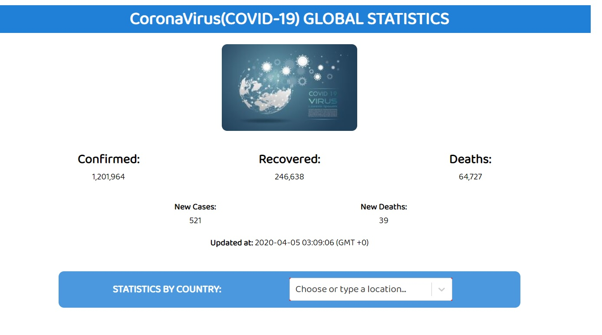
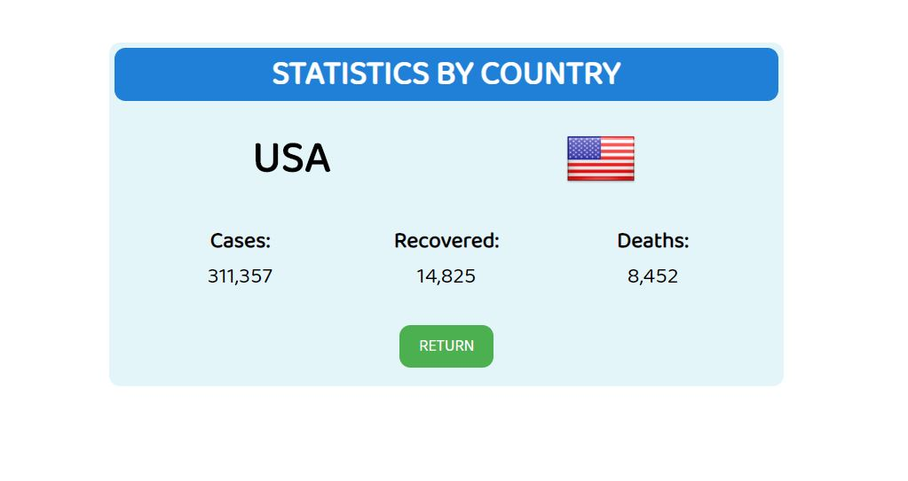

# Capstone Project: Catalogue of Statistics

> Final React Project of the Microverse Technical Curriculum Program, this project consists in a Single Page Application made with React/Redux, the application uses API calls to display updated covid-19 virus global statistics and country statistics by filtering each country through a dropdown list.

## Built With

- HTML/CSS
- Javascript
- React
- Redux

## Tools used

- React select (styling)
- Enzyme (testing)
- Heroku (deployment)

## App Screenshot



## Live Demo

[Live Demo Link](https://covid-19statistics.herokuapp.com/stats/)

## API used

[Coronavirus monitor](https://rapidapi.com/astsiatsko/api/coronavirus-monitor)

## Getting Started

To get a local copy up and running follow these simple steps.

### Setup

Open a terminal window, go to the location you'd like to add the project and then run the commands below.

```console
git clone https://github.com/noomdalv/react_covid19_stats.git
```

```console
npm install
```

```console
npm start
```

## Author

👤 **Vladimir Luna**

- Github: [@noomdalv](https://github.com/noomdalv)

## Show your support

Give a ⭐️ if you like this project!


## 📝 License

This project is [MIT](lic.url) licensed.
​
